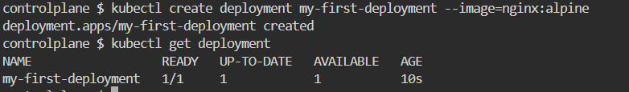
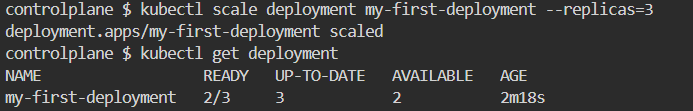
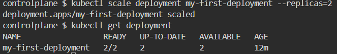
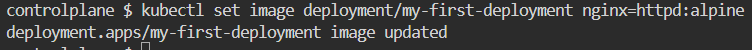
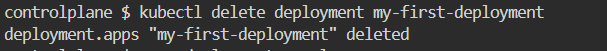
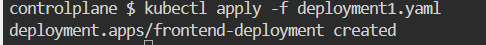
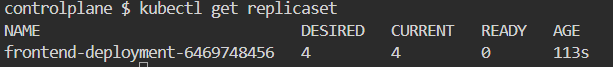
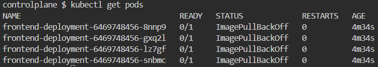
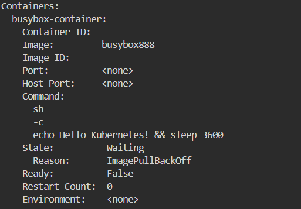
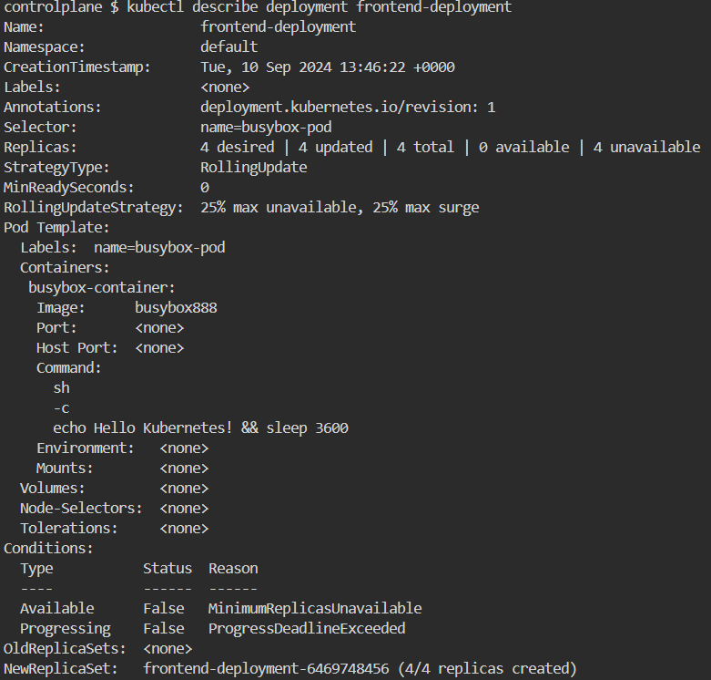

# k8s-lab3

1. the created deployment :
    

2. here is the number of replicas after scaling up:
    

3. here is the number of replicas after scaling down :
    

4. here the deployment after update :
    

5. my-first-deployment is deleted :
    

6. the yaml file of the deployment is created :
    

7. the number of replicas exist in the system :
    

8. the number of pods in the system :
    

9. the number of ready pods in the system :
    

10. the image that used to create the pods is busybox888 :
    

11. the deployment is not ready because the image does not exist :
    